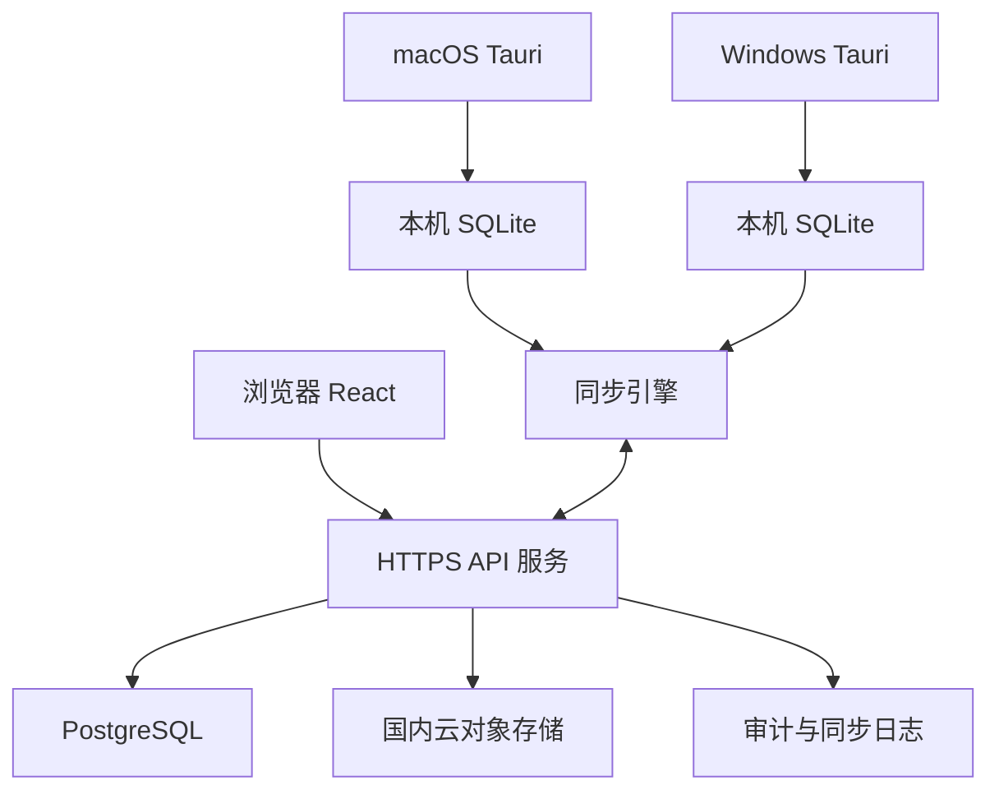

# 项目管理线上版

面向企业内部项目经营管理的线上系统。系统同时提供浏览器、macOS 桌面端和 Windows 桌面端，支持多人按权限访问项目，并允许桌面端在断网时继续编辑、恢复网络后自动同步。

> 当前状态：M1 工程基线开发阶段。共享版本、API 健康检查和 Web 连通状态已经建立；账号、业务数据、离线同步和桌面原生能力尚未实现。

## 一、建设目标

- 将现有本地项目管理软件升级为可在国内云环境运行的线上系统。
- 浏览器、macOS 和 Windows 客户端使用统一账号、权限和业务数据。
- 桌面端断网时仍可查看和编辑已同步到本机的数据。
- 恢复网络后自动上传本地变更并拉取服务器最新数据。
- 项目照片、合同附件、造价 Excel 等文件统一保存到国内云对象存储。
- 保留项目经营、合同、回款、进度、造价、风险、待办和照片等现有业务能力。
- 首期容量按 200 名用户、1000 个项目、文件每年增长约 200GB 设计。

## 二、已确认范围

### 使用端

| 使用端 | 网络要求 | 主要能力 |
| --- | --- | --- |
| 浏览器 | 首期在线使用 | 项目管理、查询、审批查看、文件预览与下载、管理后台 |
| macOS 桌面端 | 支持离线 | 完整项目管理、本地文件能力、离线编辑、自动同步、macOS 日历和提醒事项 |
| Windows 桌面端 | 支持离线 | 完整项目管理、本地文件能力、离线编辑、自动同步 |

Windows 首期不接入 Windows 日历或 Microsoft To Do。

### 用户与权限

- 账号由系统管理员创建、启用、停用和重置密码。
- 普通用户只能查看和编辑自己被授权参与的项目。
- 领导可以查看全部项目资料，默认不直接获得全部项目的编辑权限。
- 管理员可以管理账号、角色、项目授权和系统配置，并全局新增、修改和逻辑删除全部项目业务数据。
- 普通用户和领导的项目编辑权限通过项目成员关系或单独授权赋予，不依赖前端隐藏按钮实现。
- 管理员全局编辑权不包含直接执行完整项目导出或永久物理删除。
- 所有权限必须由服务端校验，浏览器和桌面端不能绕过权限限制。

### 业务模块

- 项目总览与经营指标
- 项目台账和项目详情
- 项目成员与负责人
- 合同及合同付款节点
- 回款、应回款和结算
- 项目进度与里程碑
- 签证管理
- 造价导入、版本与预警
- 风险和待办闭环
- 项目照片和附件
- 项目归档与恢复
- 用户、角色和项目授权
- 操作日志与同步状态

## 三、总体架构

采用“模块化单体服务 + Web 客户端 + Tauri 桌面客户端 + 离线同步”的架构。首期不建设微服务，不引入 Kubernetes，也不为当前规模增加不必要的分布式组件。



### 推荐技术方向

- 前端：React、TypeScript、Vite
- 桌面端：Tauri，共用主要 React 界面和领域逻辑
- 桌面本地数据：SQLite
- 服务端：TypeScript 模块化单体 API
- 中央业务数据：PostgreSQL
- 文件：国内云对象存储
- 接口：HTTPS JSON API，文件使用受控上传和下载地址
- 部署：容器化部署到国内云服务器或托管容器服务

最终框架和云厂商产品在实施计划中确认，README 不绑定某一家云厂商。

## 四、离线与同步规则

### 本地写入

桌面端的新增、修改和删除必须先在本机 SQLite 事务中完成，同时生成一条待同步操作。用户操作不等待网络请求，因此断网时仍能正常使用。

### 自动同步

1. 客户端检测到网络和登录状态恢复。
2. 上传尚未同步的业务操作。
3. 上传待传照片和附件。
4. 拉取当前用户有权访问的服务器增量数据。
5. 更新本机数据和同步游标。
6. 对失败任务进行退避重试，并向用户显示明确状态。

同步必须支持重复提交而不产生重复数据。每次操作使用全局唯一标识，服务器返回明确的成功、拒绝或失败结果。

### 冲突处理

- 并发修改采用最后提交到服务器的有效操作覆盖旧值。
- 覆盖粒度是一笔合同、一条回款、一个里程碑等业务记录，不能用整个项目对象覆盖。
- 最后顺序以服务器提交顺序为准，不信任客户端系统时间。
- 覆盖前后的操作者、时间、设备和关键字段摘要进入审计日志。
- 删除使用墓碑记录同步到所有设备，避免离线设备重新上传已删除内容。

### 权限变化

- 用户失去项目权限后，服务器立即拒绝新的读取和写入请求。
- 桌面端下次同步时移除该项目的可编辑权限。
- 对本地缓存资料的清理策略需兼顾安全、审计和误操作恢复。

## 五、文件同步

- 照片和附件内容保存到对象存储，数据库只保存文件元数据和对象标识。
- 本机绝对路径不得上传为其他用户可见的业务字段。
- 大文件采用分片上传、断点续传、校验值和失败重试。
- 桌面端离线时可访问已缓存文件，新文件进入待上传队列。
- 浏览器通过短时授权地址预览或下载文件。
- 文件访问必须同时校验用户身份和项目权限。
- 对象存储开启服务端加密、版本或误删保护、生命周期和跨区域备份策略。
- 文件删除先进入可恢复状态，达到保留期限后再物理清理。

## 六、账号与安全

- 账号由管理员开通，不提供公开注册。
- 密码只保存安全哈希，不保存或记录明文密码。
- 浏览器登录态使用安全 Cookie；桌面端凭证保存到 macOS Keychain 或 Windows Credential Manager。
- 所有外部访问强制 HTTPS。
- 登录、密码重置、权限变更、数据导出、文件下载和关键业务修改进入审计日志。
- 普通日志不得记录密码、令牌、完整个人联系方式、文件内容或其他敏感资料。
- 完整备份与可分享导出分离；可分享导出默认移除个人信息、本机路径和系统同步标识。
- 数据库和对象存储不直接暴露到公网，只允许应用服务和受控运维通道访问。

## 七、国内云准备清单

### 基础资源

- 企业实名认证的国内云账号
- 独立域名和 DNS
- ICP 备案材料
- HTTPS 证书及自动续期方案
- 应用运行环境
- 托管 PostgreSQL 或受控数据库实例
- 对象存储桶和文件生命周期策略
- 日志、监控和告警服务
- 数据库自动备份和恢复演练环境
- 桌面安装包及自动更新文件的发布存储

### 容量基线

- 账号容量：至少 200 名活跃用户，并保留扩展余量
- 项目容量：至少 1000 个项目及其历史记录
- 文件增长：每年约 200GB
- 对象存储按三年约 600GB 原始增长量规划，并额外考虑历史版本、备份和缩略图
- 数据库容量与性能在导入真实脱敏样本后通过压测确定

### 环境隔离

- 开发环境
- 测试环境
- 生产环境

三个环境必须使用不同的数据库、对象存储、密钥和域名，不得共用生产数据。

## 八、建议代码结构

```text
项目管理线上版/
├── apps/
│   ├── web/          # 浏览器应用
│   ├── desktop/      # macOS 与 Windows Tauri 应用
│   └── api/          # 模块化单体 API 与后台任务
├── packages/
│   ├── domain/       # 共享业务类型、规则与计算
│   ├── ui/           # Web 与桌面端共享界面组件
│   └── sync/         # 同步协议、操作格式与状态模型
├── docs/             # 架构、接口、部署和运维文档
├── infra/            # 不含真实凭证的部署模板
└── README.md
```

共享代码只包含真正需要在多个端保持一致的业务规则，平台文件操作和系统集成分别放在桌面端适配层中。

## 九、实施阶段

### 阶段 1：领域模型与工程基线

- 确认业务数据边界和权限矩阵
- 建立 Web、桌面、API 和共享包结构
- 建立代码检查、测试和构建流水线
- 定义版本化接口和同步操作格式

### 阶段 2：账号、权限与在线业务

- 完成管理员开通账号和登录
- 完成普通用户、领导、管理员权限
- 将核心项目、合同、回款和进度迁移为在线 API
- 完成浏览器端主要业务流程

### 阶段 3：桌面本地数据与同步

- 接入本机 SQLite
- 实现本地事务和待同步队列
- 实现增量上传、拉取、重试、墓碑和审计
- 验证长时间离线和多设备最后覆盖规则

### 阶段 4：文件与对象存储

- 完成照片和附件分片上传
- 完成本地缓存、断点续传和权限下载
- 完成文件误删恢复和生命周期策略

### 阶段 5：跨平台交付

- 构建并签名 macOS 安装包
- 构建并签名 Windows 安装包
- 建立桌面端自动更新流程
- 完成浏览器、macOS 和 Windows 一致性测试

### 阶段 6：迁移与上线

- 从现有本地版导出结构化迁移包
- 在隔离环境校验项目数量、金额汇总、附件和关联关系
- 选择小范围用户试运行
- 执行全量迁移和新旧系统切换
- 保留旧系统只读备份和回退方案

## 十、验收标准

- 200 名用户和 1000 个项目在目标负载下正常使用。
- 普通用户无法查看或修改未授权项目。
- 领导可以查询全部项目资料，但不能修改未授权项目。
- 管理员可以查询、新增、修改和逻辑删除全部项目业务数据。
- 桌面端断网后可继续编辑已同步项目。
- 网络恢复后业务记录和文件能够自动补传。
- 重复同步不会产生重复合同、回款、照片或待办。
- 并发修改按服务器最后提交顺序覆盖，并可在审计日志中追溯。
- 用户被取消项目权限后不能继续上传该项目修改。
- macOS 与 Windows 桌面端可以安全升级。
- 数据库和对象存储备份能够在演练环境成功恢复。
- 关键业务计算结果与现有本地版迁移前后一致。

## 十一、首期不做

- Windows 日历或 Microsoft To Do 同步
- 浏览器完整离线编辑
- 公开注册和个人自助开通账号
- 微服务拆分和 Kubernetes 集群
- 未经确认的审批流、即时聊天或外部客户门户

## 十二、设计文档

当前已形成：

1. 权限矩阵与项目成员规则
2. 领域数据模型与迁移映射
3. 离线同步协议
4. 文件存储与缓存方案
5. 国内云部署拓扑
6. 模块化单体与最后覆盖架构决策

生产云厂商、部署地域、域名与 ICP 主体在生产环境建设前确认，不阻塞本地工程基线开发。

## 十三、开发环境

### 环境要求

- Node.js 22.12 或更高的 22.x 版本
- npm 10

仓库只使用 npm，依赖版本由根目录 `package-lock.json` 锁定。

### 首次安装

macOS 或 Linux：

```bash
cp .env.example .env
npm ci
```

Windows PowerShell：

```powershell
Copy-Item .env.example .env
npm ci
```

`.env` 仅用于本机公开开发配置，已经加入 `.gitignore`。不得在其中提交密码、令牌、密钥或真实生产地址。

### 启动

```bash
npm run dev
```

- Web：`http://127.0.0.1:5173`
- API 健康检查：`http://127.0.0.1:3000/api/v1/health`

根启动命令会先构建共享领域包，再同时启动 Fastify API 和 Vite Web。Web 开发服务器将 `/api` 请求代理到本机 API。

### 验证

提交前执行：

```bash
npm run verify
```

该命令依次执行 lint、格式检查、类型检查、测试和全部工作区构建。CI 使用相同的 Node.js 主版本和验证步骤。

### 工作区

| 工作区 | M1 职责 |
| --- | --- |
| `packages/domain` | 提供唯一系统版本常量 |
| `packages/ui` | 共享 UI 包边界，尚无组件库 |
| `packages/sync` | 同步包边界，尚无同步实现 |
| `apps/api` | Fastify 应用和版本化健康检查 |
| `apps/web` | React 开发状态页和 API 连通检查 |
| `apps/desktop` | 桌面包边界，尚未接入 Tauri |

M1 不连接数据库，不包含账号登录、项目业务、离线编辑、文件上传或桌面安装包。
