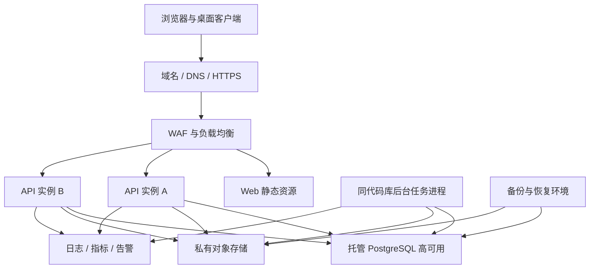

# 国内云部署拓扑与运维基线

## 1. 目标

- 支撑首期 200 名用户、1000 个项目和每年约 200GB 文件增长。
- 为浏览器、macOS 和 Windows 提供统一 HTTPS API。
- 隔离开发、测试、生产环境和数据。
- 优先使用国内云托管能力，减少小团队自建基础设施的运维负担。
- 首期保持模块化单体，不引入微服务、Kubernetes 和非必要中间件。

## 2. 生产拓扑

后台任务进程属于同一模块化单体代码库和发布版本，只以独立进程运行文件校验、预览生成、过期清理和通知任务，不视为独立微服务。

## 3. 环境隔离

| 项目 | 开发 `dev` | 测试 `test` | 生产 `prod` |
| --- | --- | --- | --- |
| 域名 | 独立开发域名 | 独立测试域名 | 正式备案域名 |
| 应用 | 开发部署 | 稳定候选版本 | 已批准正式版本 |
| 数据库 | 独立实例或独立受控库 | 独立实例 | 独立高可用实例 |
| 对象存储 | 独立存储桶 | 独立存储桶 | 独立私有存储桶 |
| 密钥 | 开发专用 | 测试专用 | 生产专用 |
| 数据 | 纯虚构或合成 | 脱敏或合成 | 正式业务数据 |
| 日志 | 短期保留 | 验收期保留 | 按审计策略保留 |

禁止把生产数据库备份直接恢复到开发环境。确需排查时必须经过审批并执行不可逆脱敏。

## 4. 网络边界

- API、Web 和桌面更新入口通过 HTTPS 对外开放。
- 数据库、对象存储管理接口、密钥管理和运维入口不直接暴露公网。
- API 与数据库通过云内网连接，并限制安全组来源。
- 对象存储桶保持私有，只允许应用身份和短时授权访问。
- 运维访问使用独立受控通道、多因素认证和最小权限。
- 生产环境不允许使用默认口令、共享管理员账号或长期静态下载地址。
- 出站访问采用白名单或监控策略，防止应用被利用后任意外传数据。

## 5. 初始资源基线

以下是首期预算和压测起点，不是固定采购规格。上线前根据真实脱敏负载调整。

| 资源 | 生产初始建议 | 说明 |
| --- | --- | --- |
| API 实例 | 2 台，每台 4 vCPU / 8GB | 跨故障域部署，支持滚动发布 |
| 后台任务实例 | 1 台 4 vCPU / 8GB | 文件扫描、预览、清理；可按队列压力扩容 |
| PostgreSQL | 托管高可用，4 vCPU / 16GB，200GB 起 | 开启自动备份、监控和连接限制 |
| 对象存储 | 按量计费，预算按 1TB 起评估 | 覆盖三年原始增长、版本、预览和恢复期 |
| 负载均衡 | 1 个高可用实例 | 健康检查和 TLS 终止 |
| WAF | 基础防护 | 登录、API 和文件授权入口防护 |
| 日志与指标 | 托管服务 | 至少覆盖 30 天运行日志和长期审计索引 |
| 更新文件存储 | 独立私有发布桶 | 与项目资料桶隔离，保存签名更新包 |

首期不配置 Redis。会话、幂等、提交序号和后台任务协调优先由 PostgreSQL 及应用内机制承担；只有压测或运行指标证明必要时再引入缓存或消息组件。

## 6. 应用部署单元

### 6.1 Web

- 构建为静态资源，发布到受控静态托管或对象存储加速入口。
- HTML 不长期强缓存，带内容哈希的资源可长期缓存。
- Web 只能访问当前环境 API，不允许运行时切换到其他环境。

### 6.2 API

- 无状态运行，两个实例共享中央 PostgreSQL 和对象存储。
- 健康检查分为进程存活和服务就绪。
- 数据库迁移只由发布流程中的单一受控任务执行，API 实例不并发抢跑迁移。
- 发布采用先迁移兼容结构、再滚动应用、最后清理旧结构的顺序。

### 6.3 后台任务

- 使用数据库持久化任务和租约，进程退出后任务可被重新领取。
- 任务必须幂等，重复执行不产生第二个物理文件或重复审计。
- 大文件解析、恶意文件扫描、预览生成和生命周期清理不占用 API 请求进程。
- 文件内容不写入任务日志。

## 7. 域名、备案和证书

- 使用企业实名认证云账号和企业主体域名。
- 生产服务开放前完成 ICP 备案及云厂商要求的接入备案。
- 域名、备案主体和云资源主体保持一致或提供合规授权材料。
- HTTPS 证书自动续期，并在到期前 30 天、14 天和 7 天告警。
- API、Web 和更新服务建议使用独立子域名，降低权限和缓存配置相互影响。

正式域名、云厂商和备案责任人尚需业务负责人确认，确认前只能建设开发和测试环境。

## 8. 配置与密钥

- 仓库仅提交 `.env.example` 和无真实值的配置说明。
- 生产数据库凭证、会话密钥、对象存储凭证、签名私钥和证书进入云密钥管理或受控发布系统。
- 应用实例使用短期角色凭证访问云资源，避免长期静态访问密钥。
- 不同环境使用不同密钥，禁止复制生产密钥到测试环境。
- 密钥轮换不应要求重新构建前端静态资源。
- 任何日志、错误页面和构建产物不得输出密钥值。

## 9. 发布流程

- 每个产物包含版本号、提交标识和构建时间，但不包含敏感环境配置。
- 同一产物从测试晋级生产，不在生产发布时重新编译不同代码。
- 数据库迁移必须向前兼容当前和前一应用版本。
- 冒烟失败时先回滚应用；涉及不可逆数据变化时按预先评审的恢复步骤处理。

## 10. 监控与告警

### 10.1 应用指标

- API 请求量、成功率、延迟和错误码分布
- 登录失败、账号停用和权限拒绝次数
- 同步推送成功率、拉取延迟、Outbox 积压和永久失败数
- 文件上传成功率、分片重试、校验失败和安全隔离数
- 后台任务队列长度、执行耗时和重试次数

### 10.2 资源指标

- API、任务实例 CPU、内存、磁盘和重启次数
- 数据库连接数、慢操作、容量、复制状态和备份状态
- 对象存储容量、请求错误、下载流量和生命周期清理量
- TLS 证书、域名和桌面更新清单有效期

### 10.3 初始告警基线

- 5 分钟窗口 API 5xx 比例超过 2%。
- 15 分钟窗口同步成功率低于 95%。
- 永久同步失败持续增长或单用户失败超过 20 条。
- 数据库存储使用率超过 70% 或连接使用率超过 80%。
- 对象存储日增长超过最近 30 天均值的 3 倍。
- 数据库备份失败、对象复制中断或恢复演练未按期完成。

告警阈值在试运行期依据基线调整，不能通过关闭告警掩盖持续故障。

## 11. 日志与审计

- 运行日志与业务审计分开保存和授权。
- 运行日志不记录密码、令牌、个人完整联系方式、完整同步载荷、文件内容和授权 URL 查询参数。
- 业务审计记录操作者、项目、实体、动作、结果、服务器时间、设备和有限差异摘要。
- 安全相关日志使用统一请求标识关联，不直接返回内部堆栈给客户端。
- 生产审计记录防止普通管理员修改或删除。
- 审计保留期由公司制度确认；首期建议不少于 1 年。

## 12. 备份、RPO 与 RTO

首期建议目标，需业务负责人确认：

| 范围 | RPO | RTO |
| --- | --- | --- |
| PostgreSQL 业务数据 | 不超过 15 分钟 | 不超过 4 小时 |
| 对象存储文件 | 不超过 24 小时 | 不超过 8 小时 |
| Web、API 与后台任务 | 代码无数据损失 | 不超过 2 小时 |

备份策略：

- PostgreSQL 开启连续日志或时间点恢复能力，至少保留 7 天。
- 每日备份保留 30 天，每月归档备份保留 12 个月。
- 对象存储开启版本保护和异地复制或独立备份。
- 每月执行数据库恢复抽检，每季度执行完整业务与文件联合恢复演练。
- 恢复环境与生产隔离，恢复完成后核对项目权限、金额汇总和文件校验值。

## 13. 可用性与降级

- 单个 API 实例故障由负载均衡摘除，另一实例继续服务。
- 后台任务停止不影响基础业务查询和不含文件的新数据编辑。
- 对象存储故障时业务数据同步继续，文件任务进入重试队列。
- 监控系统故障不能阻止应用运行，但必须产生外部健康告警。
- 数据库不可用时 API 明确返回临时失败，桌面端保留本地操作并重试，浏览器禁止伪装保存成功。

## 14. 桌面发布入口

- macOS 和 Windows 安装包及更新元数据与项目资料使用不同存储位置和权限身份。
- 更新包必须签名，客户端只接受受信签名和允许的更新地址。
- 发布支持逐步放量和紧急停止。
- 自动更新前检查本地数据库迁移兼容性和未同步操作安全。
- 更新失败保留当前可运行版本和本地数据。

## 15. 上线前容量验证

- 使用合成数据构造 200 名用户和 1000 个项目。
- 模拟普通用户项目列表、领导全局查询、批量同步和文件授权下载。
- 模拟至少 20 台桌面设备同时恢复网络并推送积压操作。
- 验证每年 200GB 文件增长下的生命周期、下载成本和备份容量。
- 依据 95 分位延迟、错误率、数据库负载和队列积压调整资源。

## 16. 待业务确认

以下事项不影响本地文档和工程基线，但会阻塞生产环境开通：

1. 国内云厂商。
2. 企业域名及备案主体。
3. ICP 备案责任人和材料准备人。
4. 建议 RPO、RTO 是否满足业务要求。
5. 审计日志正式保留期限。
6. 对象存储是否要求指定异地区域。

## 17. 验收检查

- 三套环境的域名、数据库、对象存储和密钥完全隔离。
- 生产数据库和对象存储管理接口不暴露公网。
- 任意应用部署不需要把真实密钥写入代码或镜像。
- API 可滚动发布，数据库迁移兼容前一版本。
- 备份可以在隔离环境恢复，而不仅是显示任务成功。
- 监控覆盖 API、同步、文件、任务、数据库和对象存储。
- 第 16 节完成业务确认后才允许创建生产环境。
