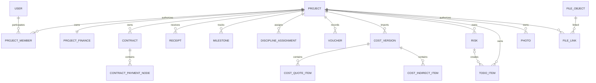

# 领域模型与旧版迁移映射

## 1. 设计目标

- 将旧版单个 `AppData` 和 `Project` 大对象拆为可独立授权、同步和审计的记录。
- 以业务记录为最后提交覆盖粒度，避免修改一个模块时覆盖其他模块。
- 明确原始字段与派生指标，禁止同一金额由多个字段分别维护。
- 支持浏览器在线访问及 macOS、Windows 桌面端离线创建记录。
- 为旧版 JSON 数据提供确定、可重复执行的迁移路径。

## 2. 通用记录字段

除会话、同步临时记录外，所有可同步业务记录包含：

| 字段 | 类型语义 | 规则 |
| --- | --- | --- |
| `id` | UUID 字符串 | 客户端可离线生成，全系统唯一且创建后不变 |
| `projectId` | UUID 字符串或空 | 项目子记录必填；系统级记录为空 |
| `createdAt` | UTC 时间 | 服务器首次接受记录时写入 |
| `createdBy` | 用户 ID | 服务器从会话身份写入，不接受客户端冒充 |
| `updatedAt` | UTC 时间 | 服务器最后有效提交时间 |
| `updatedBy` | 用户 ID | 服务器从会话身份写入 |
| `revision` | 正整数 | 每次有效修改递增，用于界面提示和审计 |
| `commitSequence` | 正整数 | 服务器全局提交序号，用于增量同步游标 |
| `deletedAt` | UTC 时间或空 | 逻辑删除墓碑时间 |
| `deletedBy` | 用户 ID 或空 | 执行逻辑删除的用户 |

客户端提交的时间仅用于展示用户操作时间，不参与最后提交胜负判断。服务器提交顺序由 `commitSequence` 决定。

## 3. 基础数据规则

### 3.1 标识

- 新版业务 ID 使用标准 UUID，由浏览器、桌面端或服务端生成。
- 旧版字符串 ID 不直接作为新版主 ID；迁移过程维护旧 ID 到新 UUID 的映射。
- 同步操作 ID 与业务 ID 分离，同一业务记录可以对应多次同步操作。

### 3.2 金额与比例

- 金额按十进制定点数处理，统一保留 2 位小数。
- 前端和共享领域包不得使用二进制浮点数直接累计业务金额。
- 比例的领域值范围为 `0` 至 `1`，计算精度至少 6 位小数，展示时再转换为百分数。
- 导入值超出合法范围时拒绝该行或进入迁移警告，不自动猜测单位。

### 3.3 日期与时间

- 业务日期使用 `YYYY-MM-DD`，不附带时区，例如计划完工日期、签订日期。
- 系统事件时间使用 UTC ISO 8601，界面按用户时区显示。
- 首期默认业务时区为 `Asia/Shanghai`。
- “待确认”不能写入日期字段；使用空值并由界面显示“待确认”。

### 3.4 删除

- 可同步业务记录先逻辑删除，保留墓碑供离线设备拉取。
- 物理清理只能由后台保留策略执行。
- 项目首期只支持归档和恢复，不提供业务永久删除接口。

## 4. 领域关系

## 5. 系统与授权实体

### 5.1 `User`

| 字段 | 说明 |
| --- | --- |
| `id` | 用户 ID |
| `username` | 唯一登录名，规范化后比较 |
| `displayName` | 显示姓名 |
| `role` | `USER`、`LEADER`、`ADMIN` |
| `accountStatus` | 账号状态：`ACTIVE`、`DISABLED`，决定账号是否可以访问系统 |
| `credentialStatus` | 凭证状态：`PENDING_ACTIVATION`、`READY`、`RESET_REQUIRED`，决定密码是否可用于登录 |
| `passwordHash` | 密码安全哈希，仅服务端可访问 |
| `passwordChangedAt` | 密码最后变更时间 |

账号状态与凭证状态必须独立判定：只有 `ACTIVE/READY` 的组合可以登录和使用受保护接口。账号不得保存明文密码。用户停用不删除历史审计关系。

### 5.2 `CredentialTicket`

| 字段 | 说明 |
| --- | --- |
| `id` | 一次性凭证记录 ID |
| `userId` | 所属用户 ID |
| `purpose` | `ACTIVATION` 或 `PASSWORD_RESET` |
| `ticketDigest` | 一次性码摘要，不保存原值 |
| `issuedAt` | 签发时间 |
| `expiresAt` | 失效时间 |
| `usedAt` | 使用时间；空值表示尚未使用 |
| `revokedAt` | 作废时间；重新签发或账号状态变化时填写 |

一次性码只在签发时返回给管理员用于安全转交；用户自行使用后设置密码，管理员不能设置、读取或导出用户密码。

### 5.3 `Session`

| 字段 | 说明 |
| --- | --- |
| `id` | 会话 ID |
| `userId` | 当前认证用户 ID |
| `tokenDigest` | 会话令牌摘要，不保存原值 |
| `issuedAt` | 创建时间 |
| `expiresAt` | 失效时间 |
| `revokedAt` | 撤销时间；账号停用、密码重置或退出时填写 |
| `deviceName` | 用户提供的设备显示名称摘要 |

会话认证时读取用户当前账号和凭证状态，不能只信任会话创建时的状态或角色快照。

### 5.4 `Device`

| 字段 | 说明 |
| --- | --- |
| `id` | 安装实例生成的设备 ID |
| `userId` | 当前绑定用户 |
| `platform` | `WEB`、`MACOS`、`WINDOWS` |
| `name` | 用户可识别的设备名称 |
| `lastSeenAt` | 最近成功访问时间 |
| `revokedAt` | 设备会话撤销时间 |

macOS 日历 ID、提醒事项 ID 及本机原生对象 ID 只保存在对应设备本地，不进入中央业务数据。

### 5.5 `ProjectMember`

| 字段 | 说明 |
| --- | --- |
| `id` | 成员关系 ID |
| `projectId` | 项目 ID |
| `userId` | 用户 ID |
| `memberRole` | `OWNER`、`EDITOR`、`VIEWER` |
| `jobTitle` | 项目内职务 |
| `phone` | 联系方式，按项目权限展示 |
| `remark` | 备注 |

同一用户在同一项目只能有一条有效成员关系。

## 6. 项目与经营实体

### 6.1 `Project`

| 字段 | 说明 |
| --- | --- |
| `id` | 项目 ID |
| `name` | 项目名称 |
| `year` | 签约年份 |
| `type` | 项目类型 |
| `status` | 项目状态枚举 |
| `phase` | 当前阶段 |
| `lifecycle` | `ACTIVE`、`ARCHIVED` |
| `filingStatus` | 报建状态 |
| `plannedCompletionDate` | 计划完工日期或空 |
| `actualCompletionDate` | 实际完工日期或空 |

首期项目状态沿用：中标待签、施工中、深化中、完工未验收、待验收、验收未结算、结算未回款、已结算待回款。

### 6.2 `ProjectFinance`

每个项目一条，用于保存非派生经营基础值。

| 字段 | 说明 |
| --- | --- |
| `id` | 财务记录 ID |
| `projectId` | 项目 ID，唯一 |
| `settlementAmount` | 结算金额或空 |

以下指标不持久化为可编辑权威字段：

| 指标 | 唯一计算规则 |
| --- | --- |
| 合同总额 | 未删除合同 `amount` 之和 |
| 累计回款 | 未删除回款 `amount` 之和 |
| 应回款 | `max(0, 结算金额或合同总额 - 累计回款)` |
| 回款率 | `累计回款 / (结算金额或合同总额)`；分母为 0 时结果为 0 |

API 返回项目经营摘要时由共享领域规则计算；客户端只能缓存计算结果，不能将其作为独立编辑来源上传。

### 6.3 `Contract`

| 字段 | 说明 |
| --- | --- |
| `id` | 合同 ID |
| `projectId` | 项目 ID |
| `name` | 合同名称 |
| `contractType` | 合同类型 |
| `contractNo` | 合同编号或空 |
| `counterparty` | 相对方或空 |
| `amount` | 合同金额 |
| `status` | `PENDING_SIGNATURE`、`ACTIVE`、`SETTLED` |
| `signedDate` | 签订日期或空 |
| `paymentNote` | 付款说明 |
| `remark` | 备注 |

附件不保存路径数组，通过 `FileLink` 关联。

### 6.4 `ContractPaymentNode`

| 字段 | 说明 |
| --- | --- |
| `id` | 节点 ID |
| `projectId` | 项目 ID，用于权限与同步过滤 |
| `contractId` | 合同 ID |
| `name` | 节点名称 |
| `condition` | 触发条件 |
| `ratio` | 计划比例或空 |
| `amount` | 计划金额或空 |
| `amountNote` | 无法数值化的金额说明或空 |
| `achieved` | 是否达成 |
| `sortOrder` | 合同内排序号 |

付款节点仅表示计划进度，不参与累计回款计算。

### 6.5 `Receipt`

| 字段 | 说明 |
| --- | --- |
| `id` | 回款 ID |
| `projectId` | 项目 ID |
| `receivedDate` | 回款日期或空 |
| `amount` | 回款金额 |
| `payer` | 付款方 |
| `note` | 说明 |

回款附件通过 `FileLink` 关联。

## 7. 执行、造价与督办实体

### 7.1 `Milestone`

| 字段 | 说明 |
| --- | --- |
| `id` | 里程碑 ID |
| `projectId` | 项目 ID |
| `discipline` | 专业分组 |
| `name` | 节点名称 |
| `durationDays` | 计划工期或空 |
| `plannedStartDate` | 计划开始或空 |
| `plannedEndDate` | 计划完成或空 |
| `actualStartDate` | 实际开始或空 |
| `actualEndDate` | 实际完成或空 |
| `status` | `NOT_STARTED`、`IN_PROGRESS`、`COMPLETED` |
| `note` | 备注 |
| `sortOrder` | 专业内排序号 |

### 7.2 `DisciplineAssignment`

| 字段 | 说明 |
| --- | --- |
| `id` | 分配关系 ID |
| `projectId` | 项目 ID |
| `discipline` | 专业名称 |
| `projectMemberId` | 对应项目成员 |

同一项目同一专业首期只允许一名主负责人。

### 7.3 `Voucher`

| 字段 | 说明 |
| --- | --- |
| `id` | 签证 ID |
| `projectId` | 项目 ID |
| `detail` | 签证明细 |
| `occurredDate` | 发生日期 |
| `declaredAmount` | 申报金额 |
| `priced` | 是否认价 |
| `approvedAmount` | 最终认定费用或空 |
| `receivedAmount` | 最终收到费用或空 |

签证金额不自动修改合同、结算或回款。

### 7.4 `CostVersion`

| 字段 | 说明 |
| --- | --- |
| `id` | 造价版本 ID |
| `projectId` | 项目 ID |
| `fileId` | 原始 Excel 文件 ID 或空 |
| `fileName` | 导入时文件名 |
| `importedAt` | 服务器接受时间 |
| `projectNo` | 造价文件项目编号或空 |
| `summary` | 经过版本化校验的结构化摘要 |
| `sourceSchemaVersion` | 解析器结构版本 |

原始模板不在每个版本中重复嵌套。报价明细与间接成本明细分别保存为 `CostQuoteItem`、`CostIndirectItem`，利润摘要保存于版本化结构中。

### 7.5 `Risk`

| 字段 | 说明 |
| --- | --- |
| `id` | 风险 ID |
| `projectId` | 项目 ID |
| `title` | 标题 |
| `level` | `HIGH`、`MEDIUM`、`LOW` |
| `description` | 风险说明 |
| `ownerMemberId` | 责任项目成员或空 |
| `measure` | 应对措施 |
| `plannedCloseDate` | 计划完善日期或空 |
| `status` | `PENDING`、`RESOLVED` |
| `closedAt` | 完善时间或空 |

项目风险等级由未完善风险的最高等级派生，不在 `Project` 上独立维护。

### 7.6 `TodoItem`

| 字段 | 说明 |
| --- | --- |
| `id` | 待办 ID |
| `projectId` | 项目 ID |
| `riskId` | 来源风险 ID 或空 |
| `title` | 标题 |
| `ownerMemberId` | 责任项目成员或空 |
| `dueDate` | 到期日期或空 |
| `reminderAt` | 提醒时间或空 |
| `priority` | `HIGH`、`MEDIUM`、`LOW` |
| `status` | `PENDING`、`COMPLETED` |
| `description` | 说明 |
| `completedAt` | 完成时间或空 |

macOS 原生同步状态属于设备本地适配数据，不参与跨平台业务同步。

## 8. 文件与照片实体

### 8.1 `FileObject`

保存对象存储中的物理文件信息：对象键、原始文件名、内容类型、字节数、校验值、上传状态、创建者和删除状态。对象键不包含用户输入的原始路径。

### 8.2 `FileLink`

将文件关联到项目、合同、回款、签证、造价版本或其他记录。每条关联同时包含 `projectId`，文件授权始终先校验项目读取权。

### 8.3 `Photo`

| 字段 | 说明 |
| --- | --- |
| `id` | 照片业务记录 ID |
| `projectId` | 项目 ID |
| `fileId` | 文件对象 ID |
| `capturedDate` | 拍摄日期 |
| `discipline` | 专业 |
| `phase` | 阶段 |
| `description` | 说明 |
| `riskId` | 关联风险或空 |
| `milestoneId` | 关联里程碑或空 |
| `contractId` | 关联合同或空 |
| `costItemId` | 关联造价明细或空 |
| `filingReference` | 报建关联或空 |

本机 `localPath`、项目照片根目录和缓存路径仅保存于桌面端本地数据库。

## 9. 同步与审计实体

### 9.1 `SyncOperation`

保存客户端上传操作的幂等标识、设备、业务记录、动作、处理结果和服务器提交序号。业务载荷按最短必要期限保留，敏感内容不写普通日志。

### 9.2 `ChangeLog`

每次有效业务提交生成一条可按 `commitSequence` 拉取的变更。变更包含业务类型、记录 ID、项目 ID、最新修订号和删除状态。

### 9.3 `AuditEvent`

保存操作者、动作、目标记录、项目、服务器时间、设备、结果和有限字段差异。密码、令牌、完整文件内容和个人敏感字段不得进入差异正文。

## 10. 旧版迁移映射

| 旧版来源 | 新版目标 | 迁移规则 |
| --- | --- | --- |
| `AppData.projects[]` | `Project` | 每个旧项目生成一个新 UUID 并建立 ID 映射 |
| `Project.contractAmount` | 不直接迁移 | 以有效合同金额之和重新计算 |
| `Project.receivedAmount` | 不直接迁移 | 优先迁移 `receipts` 后重新计算 |
| `Project.settlementAmount` | `ProjectFinance.settlementAmount` | 保留 2 位小数 |
| `Project.owner` | `ProjectMember` | 能匹配账号则设为 `OWNER`；否则生成迁移警告，禁止创建虚假登录账号 |
| `Project.owners[]` | `ProjectMember` | 同名同联系方式去重；职务写入 `jobTitle` |
| `Project.contracts[]` | `Contract` | 保留业务值并关联新项目 ID |
| `Contract.paymentNodes[]` | `ContractPaymentNode` | `received` 只用于兼容读取，迁移到 `achieved` |
| `Contract.attachmentPaths[]` | `FileObject`、`FileLink` | 文件存在且获用户确认后上传；不存在则生成警告 |
| `Project.receipts[]` | `Receipt` | 每笔独立迁移；附件单独上传关联 |
| 仅有 `receivedAmount` 的旧项目 | `Receipt` | 生成一笔明确标记为“历史累计回款”的迁移记录 |
| `Project.milestones[]` | `Milestone` | `group` 迁移为 `discipline` |
| `milestoneGroupOwners` | `DisciplineAssignment` | 通过旧成员 ID 映射到新成员关系 |
| `Project.vouchers[]` | `Voucher` | 金额字段按 2 位小数迁移 |
| `Project.budget.template` | `CostVersion` 及明细 | 生成一个历史版本，原文件可用时作为 `FileObject` 上传 |
| `Project.budget.versions[]` | 多个 `CostVersion` | 去除重复嵌套模板，按版本保存摘要和明细 |
| `Project.riskLevel/riskText` | `Risk` | 仅当不存在等价独立风险时生成一条历史风险 |
| `AppData.risks[]` | `Risk` | 优先迁移独立风险并规范旧状态 |
| `AppData.todos[]` | `TodoItem` | 不迁移设备原生日历标识 |
| `AppData.photos[]` | `Photo`、`FileObject` | 文件存在且确认后上传；本机路径不进入服务端 |
| `syncSettings` | 不迁移到服务端 | macOS 客户端首次使用时重新选择本机目标 |
| `completionDate` | `plannedCompletionDate` | 仅在新版计划完工日期为空时迁移 |

## 11. 迁移幂等与对账

- 每个迁移批次生成唯一 `migrationBatchId`。
- 旧记录使用“来源版本 + 旧 ID + 目标类型”生成稳定迁移键。
- 重复执行相同批次时返回原目标 ID，不生成重复记录。
- 缺失文件、非法金额、无法匹配负责人和未知状态进入警告清单，不静默丢弃。
- 迁移完成后对账项目数、合同总额、结算金额、累计回款、应回款、业务子记录数和文件状态。
- 迁移失败不修改旧版原始数据。

## 12. 虚构项目关系核对

虚构项目“示例展陈项目 A”应具有：

- 1 条 `Project`
- 1 条 `ProjectFinance`
- 至少 1 名 `OWNER`
- 2 笔 `Contract`，每笔包含独立付款节点
- 3 笔 `Receipt`
- 若干 `Milestone` 和专业负责人关系
- 1 个或多个 `CostVersion`
- 独立的 `Risk` 与关联 `TodoItem`
- 每张照片由 `Photo` 指向一个 `FileObject`

修改其中一笔回款只增加该 `Receipt` 的修订号，不改变项目、合同、里程碑和其他回款的修订号。

## 13. 验收检查

- README 中每个业务模块均映射到明确实体。
- 所有项目子记录均可独立授权、同步、逻辑删除和审计。
- 合同总额、累计回款、应回款、回款率和风险等级只有一套权威计算规则。
- 本机路径、设备日历标识和安全凭证未进入中央业务模型。
- 旧版每个字段都有迁移目标、忽略理由或警告规则。
- 同一旧版迁移包重复执行不会生成重复业务记录。
