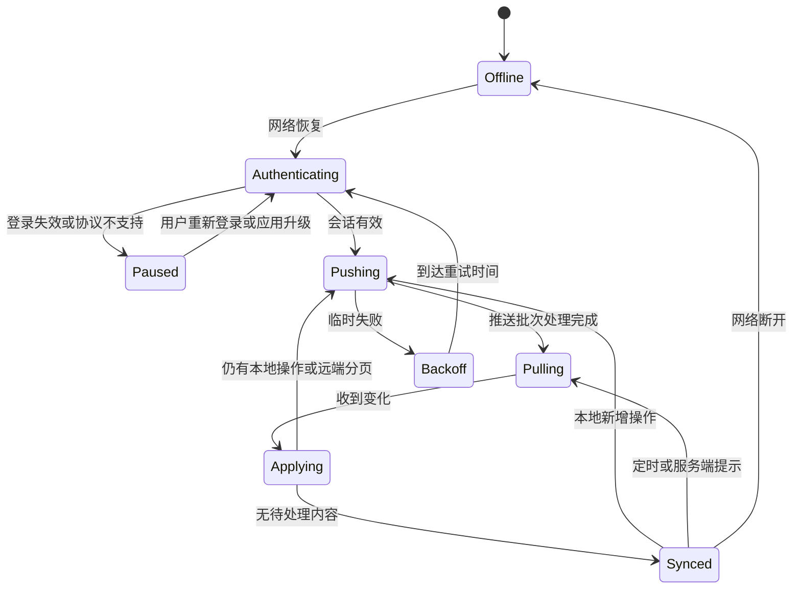
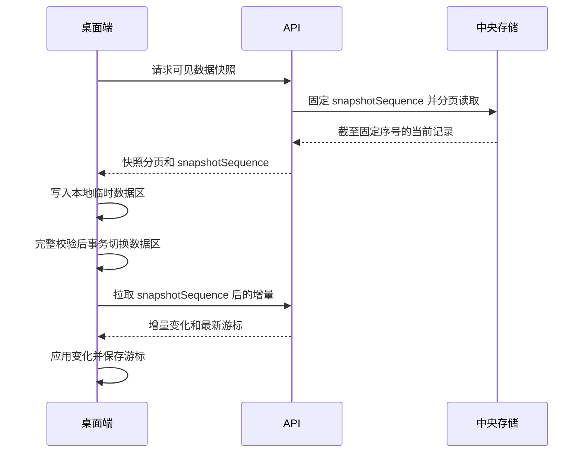
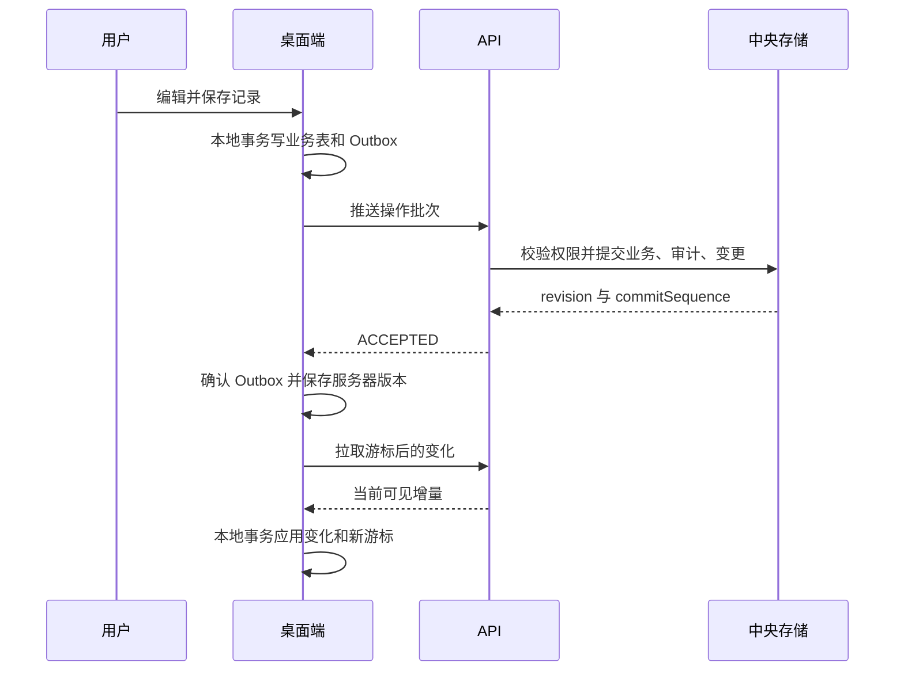
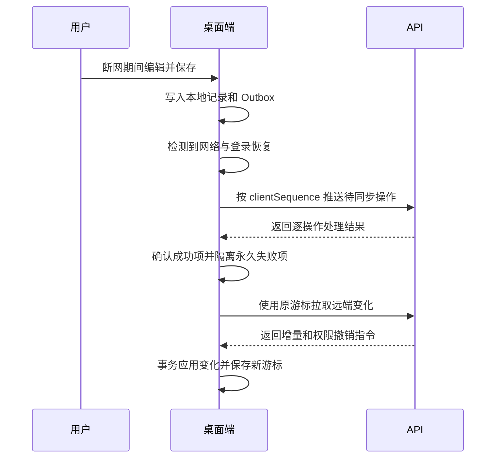
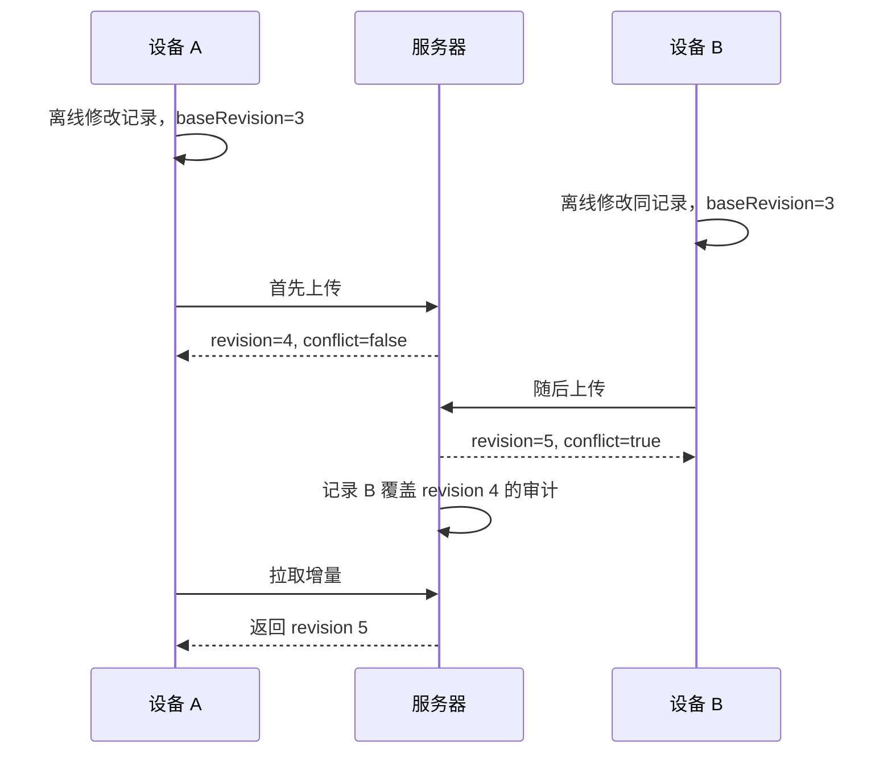

# 离线同步协议

## 1. 范围

本文定义 macOS、Windows 桌面端与中央 API 之间的业务数据同步。浏览器首期直接调用在线 API，不使用本协议进行完整离线编辑。文件内容传输见 `file-storage.md`，本协议只同步文件元数据和业务关联。

当前 M5 实现范围覆盖 `PROJECT` 实体的服务端纵向切片、桌面启动/手动同步、退避重试、冲突结果保留和权限失效隔离；文件/合同/回款等其他实体同步仍为后续工作。

## 2. 核心原则

- 桌面端业务修改与待同步操作写入同一个本地 SQLite 事务。
- 每条客户端操作具有全局唯一 `operationId`，重复提交必须幂等。
- 服务器只接受当前账号仍有权限执行的操作。
- 有效操作按服务器处理顺序产生全局递增 `commitSequence`。
- 冲突采用记录级最后有效提交覆盖，不按整个项目覆盖。
- 客户端时间不决定覆盖顺序。
- 删除通过墓碑同步，不能立即物理删除。
- 同步失败必须可见、可诊断、可重试，不静默丢弃。

## 3. 版本与传输

- 协议版本：`1`
- 传输：HTTPS JSON
- API 前缀：`/api/v1/sync`
- 业务操作推送与文件二进制上传分离。
- 服务端对解压后的请求体设置上限，拒绝超限批次。
- 客户端必须发送当前应用版本、协议版本和设备 ID。

## 4. 客户端本地表职责

| 本地记录 | 职责 |
| --- | --- |
| 业务表 | 保存当前设备可访问的项目业务数据和服务器修订号 |
| `sync_outbox` | 保存尚未确认成功的本地业务操作 |
| `sync_cursor` | 保存最后完整应用的服务器提交序号 |
| `sync_failure` | 保存需要用户处理的永久失败摘要，不保留敏感完整载荷 |
| `file_transfer_queue` | 保存文件上传或下载任务，独立于业务 Outbox |
| `device_settings` | 保存本机平台配置和原生日历标识，不上传中央业务库 |

业务表变更与 `sync_outbox` 新增必须在同一 SQLite 事务中提交。任何一方失败时整体回滚。

## 5. 操作信封

```json
{
  "protocolVersion": 1,
  "operationId": "uuid",
  "deviceId": "uuid",
  "clientSequence": 42,
  "entityType": "RECEIPT",
  "entityId": "uuid",
  "projectId": "uuid",
  "action": "UPSERT",
  "baseRevision": 3,
  "payload": {
    "receivedDate": "2026-08-09",
    "amount": "1000.00",
    "payer": "示例付款方",
    "note": "虚构测试数据"
  }
}
```

### 5.1 字段规则

| 字段 | 规则 |
| --- | --- |
| `protocolVersion` | 必须为服务端支持的版本 |
| `operationId` | UUID；同一操作重试时保持不变 |
| `deviceId` | 当前会话已登记设备 |
| `clientSequence` | 设备内单调递增，保证依赖操作顺序 |
| `entityType` | 受支持的业务记录类型 |
| `entityId` | 业务记录 UUID |
| `projectId` | 项目子记录必填，用于权限校验 |
| `action` | `UPSERT` 或 `DELETE` |
| `baseRevision` | 客户端编辑前看到的服务器修订号；离线新建为 0 |
| `payload` | 仅包含该实体允许客户端修改的字段 |

服务端忽略并拒绝客户端提交的 `createdBy`、`updatedBy`、`commitSequence`、服务器时间和其他服务端管理字段。

### 5.2 实体类型

首期同步实体：

- `PROJECT`
- `PROJECT_FINANCE`
- `PROJECT_MEMBER`
- `CONTRACT`
- `CONTRACT_PAYMENT_NODE`
- `RECEIPT`
- `MILESTONE`
- `DISCIPLINE_ASSIGNMENT`
- `VOUCHER`
- `COST_VERSION`
- `COST_QUOTE_ITEM`
- `COST_INDIRECT_ITEM`
- `RISK`
- `TODO_ITEM`
- `PHOTO`
- `FILE_OBJECT`
- `FILE_LINK`

用户账号、系统角色、会话、密码、设备安全凭证不通过普通业务同步操作修改。

## 6. 推送接口

### 6.1 请求

`POST /api/v1/sync/push`

```json
{
  "protocolVersion": 1,
  "deviceId": "uuid",
  "operations": []
}
```

限制：

- 每批最多 100 条业务操作。
- 解压后 JSON 最大 1MB。
- 操作按 `clientSequence` 升序排列。
- 不在业务操作中传输文件二进制或大段 Excel 原始内容。

### 6.2 单操作结果

```json
{
  "operationId": "uuid",
  "status": "ACCEPTED",
  "entityId": "uuid",
  "revision": 4,
  "commitSequence": 1058,
  "conflict": true,
  "serverCommittedAt": "2026-08-09T04:00:00Z"
}
```

| 状态 | 含义 | 客户端处理 |
| --- | --- | --- |
| `ACCEPTED` | 新操作已接受 | 从 Outbox 移除，保存服务器版本 |
| `DUPLICATE` | 相同 `operationId` 已处理 | 按原结果确认成功，不重复写入 |
| `FORBIDDEN` | 当前无操作权限 | 永久失败，移除业务载荷并提示权限已失效 |
| `VALIDATION_FAILED` | 数据不符合领域规则 | 永久失败，保留可编辑记录并提示修正 |
| `NOT_FOUND` | 父记录不存在或已清理 | 永久失败，提示关联记录不可用 |
| `RETRYABLE` | 临时服务、网络或依赖故障 | 保留 Outbox 并按退避规则重试 |
| `PROTOCOL_UNSUPPORTED` | 客户端协议过旧或过新 | 暂停同步并要求升级客户端 |

同一批次逐条处理并逐条返回结果。单条永久失败不回滚已经接受的其他独立操作。M5.1 的 PROJECT 服务端实现对重复 `operationId` 返回已保存的原始单操作结果，状态字段保持第一次处理时的值，客户端不得依赖重复提交时状态必然改写为 `DUPLICATE`。

## 7. 服务端处理顺序

对每条操作依次执行：

1. 验证协议、会话、账号状态和设备状态。
2. 按 `operationId` 检查是否已经处理；如是，返回原结果。
3. 校验 `clientSequence` 及必要的父记录依赖。
4. 根据权限矩阵检查当前权限。
5. 对 `payload` 执行实体白名单和领域校验。
6. 读取目标记录当前修订号。
7. 若 `baseRevision` 小于当前修订号，将 `conflict` 标记为 `true`，但不拒绝有效提交。
8. 在一个服务器事务中写入业务记录、墓碑、审计事件、操作结果和变更日志。
9. 分配新的 `revision` 和全局 `commitSequence`。
10. 返回可供客户端幂等确认的结果。

服务器必须串行确定同一记录的最终提交顺序。不同记录可以并行处理，但每条记录的修订号不能重复或倒退。

## 8. 最后提交覆盖规则

### 8.1 `UPSERT`

- 有权限且校验通过的后提交操作覆盖该记录上一版本的全部客户端可编辑字段。
- 服务端管理字段不参与覆盖。
- 未出现在实体可编辑字段白名单中的字段被拒绝，而不是静默保存。
- `baseRevision` 落后时仍接受，并在审计中关联被覆盖的修订号。

### 8.2 `DELETE`

- 删除写入墓碑并生成新的 `revision`、`commitSequence`。
- 对已删除记录再次提交相同删除操作返回成功或重复结果。
- 删除后收到更晚且有权限的 `UPSERT` 时，默认恢复该记录并产生新修订号。
- 不允许恢复的实体由领域规则返回 `VALIDATION_FAILED`，例如归档项目下被禁止的新记录类型。

### 8.3 父子记录

- 删除项目不会直接物理删除子记录；项目进入归档或墓碑状态后，服务端按领域规则限制子记录写入。
- 删除合同后，其节点继续保留墓碑和审计关系，但默认不出现在业务查询中。
- 子记录操作必须验证父记录仍存在且允许修改。

## 9. 拉取接口

### 9.1 增量拉取

`GET /api/v1/sync/pull?after=<commitSequence>&limit=500`

响应：

```json
{
  "protocolVersion": 1,
  "changes": [],
  "nextCursor": 1058,
  "hasMore": false
}
```

规则：

- 每页最多 500 条变化。
- 仅返回当前用户仍有读取权的项目变化。
- 变化按 `commitSequence` 升序。
- 每条变化包含实体类型、记录 ID、项目 ID、最新修订号、删除状态和当前可见数据。
- 客户端在一个本地事务中应用整页变化并更新游标。
- 应用失败时不更新游标，下一次重新拉取同一页。

### 9.2 权限撤销指令

当用户失去项目权限时，拉取结果包含：

```json
{
  "type": "PROJECT_ACCESS_REVOKED",
  "projectId": "uuid",
  "commitSequence": 1059
}
```

客户端必须锁定并移除该项目业务数据、文件缓存和待传业务载荷，再更新游标。

### 9.3 首次同步与全量重建

1. 客户端请求快照，服务器固定 `snapshotSequence`。
2. 客户端分页下载截至该序号的当前可见记录。
3. 每页写入本地临时数据区。
4. 快照完成后在本地事务中切换为正式数据并保存游标。
5. 客户端继续拉取 `snapshotSequence` 之后的增量变化。

墓碑保留 180 天。客户端游标早于服务端最早可用序号时，服务器返回 `CURSOR_EXPIRED`，客户端必须执行受控全量重建。

## 10. 客户端同步循环



同一设备同时只能运行一个同步循环。用户点击“立即同步”只能唤醒现有循环，不能启动第二个并发循环。

## 11. 重试与失败隔离

### 11.1 可重试失败

网络不可用、超时、服务端限流和临时内部错误采用带抖动的退避：约 5 秒、15 秒、60 秒、5 分钟、30 分钟，之后保持 30 分钟上限。用户手动重试可以立即唤醒。

### 11.2 永久失败

`FORBIDDEN`、`VALIDATION_FAILED`、确定性的 `NOT_FOUND` 不自动重试。客户端显示实体、操作时间和可理解的原因：

- 权限失效：锁定记录并移除待传业务载荷。
- 校验失败：允许用户修正本地记录后生成新的 `operationId`。
- 关联缺失：提示恢复或移除本地记录，不自动猜测关联对象。

### 11.3 Outbox 合并

首期不在本地自动合并多个未提交操作。每次用户保存生成独立操作并按顺序提交，以保证审计清晰。后续只有在性能证据表明必要时才引入安全压缩。

## 12. 文件与业务同步顺序

- 新文件先创建本地文件任务和临时 `fileId`。
- 文件上传完成后，服务端确认 `FileObject` 为可用状态。
- 业务 `FileLink` 操作只有在文件完成后才能被服务端接受。
- 文件上传失败不阻止其他无关业务记录同步。
- 删除文件关联先同步 `FileLink` 墓碑；物理对象按保留策略清理。

## 13. 时序图

### 13.1 首次同步



### 13.2 正常增量同步



### 13.3 离线恢复



### 13.4 两台设备离线覆盖



## 14. 故障场景预期

M5.1 已自动化覆盖 PROJECT push 成功、提交成功但响应丢失后的重复提交、按游标 pull、以及成员关系移除后不再返回该项目变化。其他实体、桌面重试调度、冲突 UI、文件同步和完整故障矩阵仍在后续任务中完成。

| 场景 | 预期结果 |
| --- | --- |
| 提交成功但响应丢失 | 相同 `operationId` 重试返回 `DUPLICATE` 原结果 |
| 应用在推送一半时退出 | 已确认操作不重复；未确认操作继续重试 |
| 拉取页面应用失败 | 游标不前移，重启后重新应用同一页 |
| 两台设备修改不同记录 | 两条修改均保留 |
| 两台设备修改同一记录 | 服务器后提交记录生效并标记冲突审计 |
| 一台删除、另一台随后修改 | 后提交的有效 `UPSERT` 按实体规则恢复或拒绝 |
| 用户权限被取消后上传 | 返回 `FORBIDDEN`，客户端停止重试并清除载荷 |
| 客户端协议不受支持 | 暂停同步，业务本地数据保留，要求升级 |
| 游标超过墓碑保留期 | 返回 `CURSOR_EXPIRED` 并执行全量重建 |
| 客户端时间错误 | 不影响最终覆盖顺序 |

## 15. 安全与隐私

- 同步服务从会话取得 `userId`，不信任客户端提供操作者。
- 每条推送重新检查账号状态和项目权限。
- 普通日志只记录操作 ID、实体类型、结果和耗时，不记录完整载荷。
- 永久失败记录不长期保存敏感业务载荷。
- 协议错误不得在响应中返回数据库结构、内部路径或堆栈信息。
- 桌面端安全凭证保存在系统凭证存储，不保存到 SQLite 业务表。

## 16. 验收检查

- 同一操作重复推送不会重复创建业务记录。
- 每个成功操作都有唯一修订号、提交序号和审计事件。
- 客户端可以从任意有效游标恢复一致数据。
- 同记录后提交覆盖规则可由 `baseRevision`、`revision` 和 `commitSequence` 解释。
- 权限取消同时阻止推送、拉取和文件访问。
- 首次同步、增量同步、离线恢复、冲突覆盖和游标过期均有确定流程。
- 第 14 节全部场景必须在 M5 转换为自动化测试。
