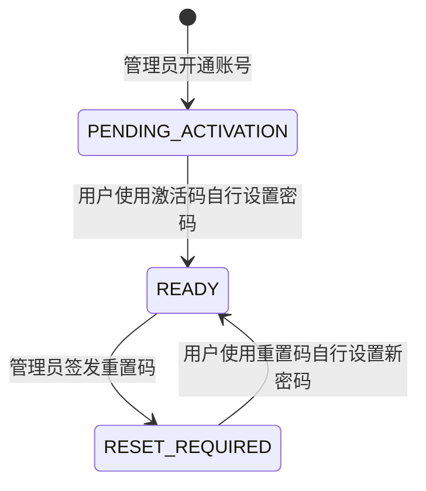

# M2 账号、会话与权限闭环设计

## 1. 目标

M2 在不连接数据库、不编写 SQL 的前提下，交付可以本机运行和自动化验收的账号、登录、会话、用户管理及项目授权基础能力。

本阶段完成后：

- 首位管理员通过一次性交互式命令创建并自行设置密码。
- 管理员只开通账号和签发一次性激活或重置码，不能替任何用户设置、读取或导出密码。
- 用户使用一次性码自行设置密码，之后可以自行修改密码。
- 浏览器使用服务端不透明会话，不在 Web Storage 中保存凭证。
- 普通用户、领导和管理员的请求由服务端统一授权。
- 管理员角色撤销、账号停用和密码重置立即使旧会话失效。

M2 不包含项目业务 CRUD、数据库适配器、离线同步、桌面凭证保存、对象存储、邮件或短信发送。

## 2. 已确认前提

- 采用方案 A：服务端不透明会话、仓储接口和本地文件适配器。
- 系统不开放注册，账号只能由管理员开通。
- 首位管理员和其他用户都必须自行设置自己的密码。
- 管理员无需项目成员关系即可全局新增、修改和逻辑删除业务数据。
- 领导全局只读，写入仍依赖 `OWNER` 或 `EDITOR` 项目成员关系。
- 普通用户只能访问已授权项目。
- 单项目完整导出仍只允许 `OWNER`，管理员不能凭系统角色直接导出。

## 3. 方案取舍

### 3.1 采用：仓储接口与本地文件适配器

领域服务只依赖仓储接口。M2 提供被 Git 忽略的 `.local-data/auth-store.json` 开发适配器，使用单进程内串行写入、临时文件替换和文件权限收敛保存状态。它支持本机重启后继续联调，但不支持多 API 实例并发写入，也不作为生产存储。

后续获得数据库开发许可后，以 PostgreSQL 适配器替换本地文件适配器，领域服务、API 契约和 Web 不随存储方式改变。

### 3.2 不采用：纯内存存储

纯内存实现无法让交互式管理员初始化结果跨进程或跨重启生效，不能形成可用的账号闭环。

### 3.3 暂不采用：直接接入 PostgreSQL

生产系统最终需要 PostgreSQL，但当前明确禁止主动连接数据库或编写 SQL。本阶段不创建连接配置、迁移脚本或查询实现。

## 4. 模块边界

### 4.1 `packages/domain/src/auth/`

只保存可共享的安全领域类型和授权规则：

- `SystemRole`：`USER | LEADER | ADMIN`
- `AccountStatus`：`ACTIVE | DISABLED`
- `CredentialStatus`：`PENDING_ACTIVATION | READY | RESET_REQUIRED`
- `ProjectMemberRole`：`OWNER | EDITOR | VIEWER`
- `ProjectAction`：读取、业务写入、逻辑删除、成员管理、归档恢复、完整导出、文件下载和审计查看
- `authorizeProjectAction(context, action)`：返回明确的允许或拒绝结果

该包不保存密码哈希、会话令牌或本地文件路径。

### 4.2 `apps/api/src/modules/auth/`

负责密码哈希、登录限制、一次性凭证、会话创建、轮换、注销、强制撤销和当前身份解析。

### 4.3 `apps/api/src/modules/users/`

负责首位管理员创建、管理员开通账号、启停账号、调整角色、签发激活码或重置码，以及最后一名有效管理员保护。

### 4.4 `apps/api/src/modules/authorization/`

把登录身份、当前账号状态、项目状态和成员关系组合为服务端授权结论。API 路由只调用该服务，不自行复制角色判断。

### 4.5 `apps/api/src/modules/audit/`

记录有限的安全事件：管理员初始化、账号创建、激活、登录成功或失败、限制登录、退出、刷新、停用、启用、角色变化、密码修改、密码重置和权限拒绝。

### 4.6 `apps/api/src/storage/`

定义仓储接口和 M2 本地文件实现。API 组合根决定使用哪种实现；领域模块不知道 JSON 文件存在。

### 4.7 `apps/web/src/features/`

- `auth/`：登录、激活、会话恢复、会话失效、修改密码和退出。
- `admin-users/`：用户列表、开通、启停、角色调整和重置入口。

## 5. 账号生命周期

账号状态和凭证状态分别保存。停用或启用账号只改变 `AccountStatus`，不会丢失原来的凭证状态。

规则：

1. 只有 `AccountStatus=ACTIVE` 且 `CredentialStatus=READY` 的账号可以登录和访问业务 API。
2. 开通账号时不接收密码字段，只生成一次性激活码。
3. 激活码由安全随机数生成，服务端只保存摘要，有效期 24 小时，只能使用一次。
4. 管理员可以为未激活账号重新签发激活码，旧码立即失效。
5. 密码重置码有效期 30 分钟，只能使用一次；签发时凭证状态进入 `RESET_REQUIRED` 并撤销全部会话。
6. 用户完成激活或重置后，服务端保存密码哈希并将凭证状态设为 `READY`。
7. 已登录用户修改密码时必须验证当前密码；成功后撤销其他会话并轮换当前会话。
8. 管理员不能为用户提交密码，也不能读取密码哈希、激活码摘要或重置码摘要。
9. 系统至少保留一个账号启用、凭证就绪的管理员；禁止停用或撤销最后一名有效管理员的管理员角色。
10. 管理员不能通过管理 API 为自己签发重置码；已登录时使用本人修改密码流程。唯一管理员遗忘密码的生产运维恢复流程不在 M2 内实现。

## 6. 首位管理员初始化

命令 `npm run bootstrap-admin --workspace @project-online/api` 在终端中依次读取登录名、显示名称和两次密码。密码输入隐藏，命令不得把密码、密码哈希或一次性凭证输出到终端。

初始化规则：

- 本地仓储没有任何用户时才允许执行。
- 创建的账号角色固定为 `ADMIN`，账号状态固定为 `ACTIVE`，凭证状态固定为 `READY`。
- 密码由管理员本人输入并立即哈希，明文只存在于当前进程内存中。
- 登录名规范化后必须唯一。
- 已存在任何用户时命令拒绝执行，不能被用作越权新增管理员的旁路。
- 本地状态目录和文件加入 `.gitignore`；目录创建后收敛为当前用户可访问。

## 7. 密码与一次性凭证

### 7.1 密码规则

- 长度按 Unicode 码点计算，为 12 至 128 个字符。
- 允许空格和非 ASCII 字符，不强制大小写、数字或符号组合。
- 拒绝纯空白密码。
- API 校验失败只返回规则错误，不回显密码内容。

### 7.2 密码存储

使用 Node.js 22 的异步 `crypto.scrypt`，每个密码使用独立的 16 字节随机盐。M2 参数固定为 `N=2^17`、`r=8`、`p=1`、`maxmem=160 MiB`，派生长度为 64 字节。持久化格式包含算法版本、参数、盐和派生结果，以便未来升级工作因子。

校验派生结果时使用 `timingSafeEqual`。普通日志、审计事件、异常消息和测试快照不得包含密码或完整哈希。

### 7.3 激活码与重置码

一次性码使用 32 字节安全随机数并编码为 base64url。API 只在创建或重新签发的成功响应中返回明文一次，仓储仅保存 SHA-256 摘要、用途、用户 ID、过期时间和使用时间。

激活与重置接口只根据高熵一次性码定位记录，不要求客户端同时提交用户名。无效、过期或已使用的一次性码返回同一错误。

## 8. 登录限制

- 用户名先做 trim 和小写规范化。
- 不存在、密码错误、账号停用或凭证未就绪统一返回 HTTP 401 和“用户名或密码错误”。
- 每个规范化用户名和来源地址组合在 15 分钟窗口内最多失败 5 次。
- 超限后返回通用 HTTP 429，不说明账号是否存在。
- 成功登录清除该组合的失败计数。
- 对不存在账号仍执行一次固定的密码哈希校验，减少明显的响应时间差异。
- 登录失败审计只保存时间、结果、来源摘要和存在时的用户 ID，不保存密码、Cookie、令牌或完整请求体。

## 9. 会话设计

### 9.1 不透明会话

登录成功生成 32 字节安全随机令牌。浏览器 Cookie 保存明文令牌；仓储只保存 SHA-256 摘要以及：

- 会话 ID、用户 ID 和设备 ID
- 平台 `WEB`
- 创建时间、最近使用时间和过期时间
- 撤销时间及不含敏感信息的撤销原因

浏览器会话有效期 30 分钟。刷新接口在有效期内生成新令牌、延长 30 分钟并使旧令牌立即失效；同一旧令牌重复刷新返回 401。

### 9.2 Cookie

- 生产：`__Host-id`、`Secure`、`HttpOnly`、`SameSite=Strict`、`Path=/`，不设置 `Domain`。
- 本机 HTTP 开发：`id`、`HttpOnly`、`SameSite=Strict`、`Path=/`，不设置 `Secure`。
- 登录、刷新、激活和重置响应设置 `Cache-Control: no-store`。
- Web 不把会话令牌、一次性码或密码写入 `localStorage`、`sessionStorage` 或 URL。
- 使用 Cookie 的状态变更请求必须携带与公开 Web 地址同源的 `Origin`；来源不匹配时返回 403。本机开发地址由公开的非敏感环境配置指定。

### 9.3 撤销

退出只撤销当前会话。账号停用、角色变化、管理员发起密码重置时撤销该用户全部会话。用户自行修改密码时撤销其他会话并轮换当前会话。

每个受保护请求都重新读取当前账号和会话状态，不能只相信会话创建时缓存的角色。

## 10. 授权规则

统一授权服务按以下顺序执行：

1. 账号必须启用且凭证状态必须为 `READY`。
2. 会话必须存在、未撤销且未过期。
3. 系统管理操作必须为当前 `ADMIN`。
4. 项目读取：`LEADER`、`ADMIN` 直接允许；`USER` 需要有效成员关系。
5. 项目业务写入和逻辑删除：`ADMIN` 直接允许；其他角色需要 `OWNER` 或 `EDITOR`。
6. 成员管理、归档和恢复：`ADMIN` 或 `OWNER`。
7. 完整项目导出：仅 `OWNER`，系统角色不产生例外。
8. 文件下载：需要项目读取权；领导或管理员跨项目下载标记为必须审计。
9. 审计查看：`OWNER`、`LEADER` 或 `ADMIN`；审计修改和删除一律拒绝。
10. 当前角色或成员关系变化后，下一次请求立即按新权限计算。

M2 不创建项目业务 API。授权服务通过覆盖 M0 全部 19 个示例的领域测试，以及用户管理 API 的真实服务端拒绝测试完成验收；M3 项目路由直接复用该服务。

## 11. API 契约

### 11.1 公开认证接口

| 方法与路径 | 作用 | 成功结果 |
| --- | --- | --- |
| `POST /api/v1/auth/activate` | 使用激活码自行设置密码 | `204` |
| `POST /api/v1/auth/login` | 登录并创建会话 | `204`，设置 Cookie |
| `POST /api/v1/auth/refresh` | 轮换有效会话 | `204`，更新 Cookie |
| `POST /api/v1/auth/password-reset/complete` | 使用重置码自行设置新密码 | `204` |

### 11.2 登录用户接口

| 方法与路径 | 作用 | 成功结果 |
| --- | --- | --- |
| `GET /api/v1/auth/session` | 返回当前用户的非敏感身份信息 | `200` |
| `POST /api/v1/auth/logout` | 撤销当前会话并清除 Cookie | `204` |
| `POST /api/v1/auth/password/change` | 本人验证旧密码后设置新密码 | `204`，轮换 Cookie |

### 11.3 管理员用户接口

| 方法与路径 | 作用 | 成功结果 |
| --- | --- | --- |
| `GET /api/v1/users` | 返回不含凭证字段的用户列表 | `200` |
| `POST /api/v1/users` | 开通无密码账号 | `201`，一次性返回激活码 |
| `POST /api/v1/users/:id/activation` | 重新签发激活码 | `200`，一次性返回激活码 |
| `POST /api/v1/users/:id/disable` | 停用账号并撤销会话 | `204` |
| `POST /api/v1/users/:id/enable` | 启用账号 | `204` |
| `PATCH /api/v1/users/:id/role` | 调整系统角色并撤销会话 | `200` |
| `POST /api/v1/users/:id/password-reset` | 签发重置码并撤销会话 | `200`，一次性返回重置码 |

所有请求体使用 Fastify JSON Schema 拒绝额外字段。认证错误使用统一错误码；管理员接口对未登录返回 401，对非管理员返回 403。响应永不包含密码哈希、会话摘要或一次性码摘要。

## 12. Web 交互

### 12.1 未登录

首屏是实际登录界面，不保留 M1 营销式说明。页面支持：

- 登录名和密码输入。
- 使用激活码设置本人密码。
- 使用重置码设置本人新密码。
- 通用登录失败、登录受限和网络失败状态。

密码输入不保存在浏览器存储；提交完成后立即从组件状态清除。

### 12.2 已登录

顶部显示产品名、当前用户、系统角色和退出命令。会话失效时清空内存状态并返回登录界面。

普通用户和领导只显示当前账号与服务状态。管理员额外看到用户管理视图：

- 用户表格：显示名称、登录名、角色、状态和更新时间。
- 开通账号对话框：只填写登录名、显示名称和角色，不提供密码字段。
- 激活码或重置码成功后在对话框中只显示一次，关闭后不再从前端恢复。
- 启用、停用、角色调整和签发重置码均有明确确认和结果状态。

## 13. 本地文件存储

M2 本地文件包含格式版本、用户、会话、一次性凭证、登录失败窗口和安全审计。写入规则：

- 文件路径固定为被忽略的 `.local-data/auth-store.json`，不接受浏览器请求指定路径。
- 所有写操作在单进程队列中串行执行。
- 先写同目录临时文件，刷新完成后原子替换目标文件。
- 进程启动时校验结构和格式版本；损坏时拒绝启动，不静默清空数据。
- 不写明文密码、明文会话令牌、明文激活码或重置码。
- 测试使用临时目录和完全虚构的数据，不读取开发人员真实本地状态。

该适配器只用于本机开发和验收。生产部署前必须在获得许可后实现数据库仓储并完成并发、事务、备份和恢复测试。

## 14. 错误与审计

稳定错误类别：

- `AUTHENTICATION_REQUIRED`：没有有效会话。
- `INVALID_CREDENTIALS`：登录信息无效或账号不可登录。
- `LOGIN_RATE_LIMITED`：登录频率受限。
- `SESSION_EXPIRED`：会话过期或已撤销。
- `FORBIDDEN`：身份有效但无操作权限。
- `INVALID_TICKET`：一次性码无效、过期或已使用。
- `LAST_ADMIN_REQUIRED`：操作会移除最后一名有效管理员。
- `VALIDATION_ERROR`：输入不符合公开规则。

普通运行日志仅记录请求标识、路由、状态码和耗时。安全审计记录操作者 ID、目标 ID、事件、结果、服务器时间及必要的项目 ID，不记录密码、完整登录名、令牌、Cookie、一次性码、密码哈希或完整请求体。

## 15. 测试与验收

### 15.1 自动化测试

- 密码哈希：相同密码不同盐、正确校验、错误密码拒绝和格式损坏拒绝。
- 首位管理员：空仓储成功、已有用户拒绝、密码不输出。
- 账号生命周期：开通、激活、码过期、码重复使用、停用、启用和重置。
- 会话：登录、退出、刷新、重复刷新、过期、停用后旧会话、角色变化后旧会话。
- 登录保护：统一错误、连续失败限制、成功后清除失败计数。
- 管理保护：非管理员越权、最后管理员停用和角色撤销。
- 权限矩阵：覆盖 `docs/architecture/permission-matrix.md` 第 9 节全部 19 个示例。
- API：Cookie 属性、401/403、响应字段白名单和请求额外字段拒绝。
- Web：登录、激活、会话失效、退出、管理员开通、启停、角色调整和一次性码只显示一次。
- 本地仓储：原子保存、重启读取、损坏文件拒绝和敏感明文缺失检查。

### 15.2 浏览器验收

使用临时本地状态完成：管理员登录、开通普通用户、用户激活并自行设置密码、普通用户无法访问用户管理、管理员停用用户后旧会话失效。桌面和移动视口均检查页面无重叠和横向溢出，页面控制台无未处理错误。

### 15.3 完成标准

- `npm ci` 和 `npm run verify` 退出 0。
- M0 权限矩阵 19 个示例均有自动化结论。
- 管理员不能提交或读取任何用户密码。
- 任意未授权用户管理请求均由 API 返回 401 或 403。
- 账号停用、角色变化和密码重置后旧会话立即失效。
- 本地状态文件不包含明文密码、令牌或一次性码。
- README 和 `TO-do.md` 只勾选实际通过的 M2 项目。

## 16. 安全依据

- [Node.js 22 Crypto：`scrypt`、`randomBytes` 与 `timingSafeEqual`](https://nodejs.org/download/release/v22.16.0/docs/api/crypto.html)
- [OWASP Password Storage Cheat Sheet](https://cheatsheetseries.owasp.org/cheatsheets/Password_Storage_Cheat_Sheet.html)
- [OWASP Session Management Cheat Sheet](https://cheatsheetseries.owasp.org/cheatsheets/Session_Management_Cheat_Sheet.html)
- [OWASP Authentication Cheat Sheet](https://cheatsheetseries.owasp.org/cheatsheets/Authentication_Cheat_Sheet.html)

## 17. 后续阶段

M2 完成后，M3 直接复用当前身份和授权服务实现项目列表、详情和编辑。数据库仓储、生产 Cookie 域名、HTTPS、云密钥管理和多实例登录限制在生产部署准备阶段单独设计并获得数据库操作许可后实施。
