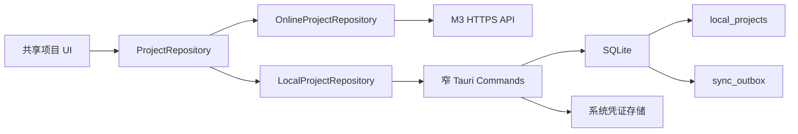
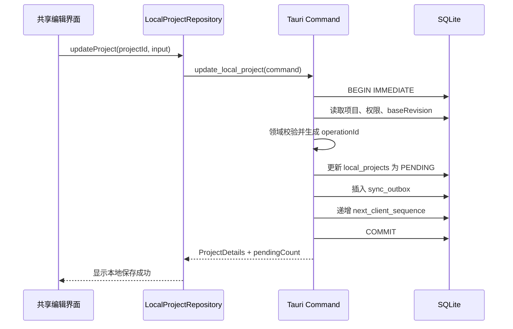

# M4 macOS 与 Windows 桌面离线基础设计

## 1. 目标

M4 建立可供后续同步引擎复用的桌面基础：macOS 与 Windows Tauri 客户端可以在无网络时启动，读取本机项目列表和详情，编辑项目并将业务修改与待同步操作原子写入 SQLite；应用退出并重启后数据不丢失。

M4 只覆盖 M3 的项目列表、项目详情和项目编辑。成员管理与审计继续通过 Web 使用，不进入本地离线数据模型。

## 2. 范围

### 2.1 包含

- 初始化 Tauri 2 桌面应用，使用现有 React、TypeScript、Vite 和领域类型。
- 从 Web 项目功能中提取可共享的项目列表、详情和编辑 UI。
- 定义 Web 与桌面共用的 `ProjectRepository` 接口。
- Web 继续通过 M3 HTTP API 工作；桌面通过 Tauri 命令访问 SQLite。
- 建立 SQLite 迁移、版本记录、项目缓存、设备状态和 Outbox。
- 在同一 SQLite 事务中更新项目记录并新增一条 Outbox 操作。
- 通过操作系统安全凭证存储保存桌面会话凭证。
- 显示离线状态和待同步操作数量，但不执行网络同步。
- 建立 macOS 与 Windows 的测试和无签名构建验证。

### 2.2 不包含

- M5 的同步推送、增量拉取、重试、冲突覆盖、权限撤销和多设备一致性。
- 项目创建、归档、恢复、成员管理和审计的离线操作。
- 照片、附件、文件缓存和上传队列。
- macOS 日历、提醒事项、Windows 日历或 Microsoft To Do 集成。
- 安装包签名、公证、自动更新和正式发布，这些内容属于 M9。
- 浏览器离线编辑。

## 3. 设计原则

1. 共享业务界面，不共享平台副作用。React 组件依赖仓储和平台接口，不直接访问 `fetch`、SQLite 或 Tauri 全局对象。
2. SQLite 只允许通过 Rust 侧的窄 Tauri 命令访问。前端不获得通用 SQL 执行能力。
3. 项目修改和 Outbox 写入由同一个 Rust 函数、同一个 SQLite 连接和同一个事务完成。
4. M4 生成与 `docs/architecture/sync-protocol.md` 兼容的操作信封，但不实现发送。
5. 凭证不进入 SQLite、普通日志、环境文件、测试快照或前端持久化存储。
6. Windows 构建不声明或包含待办、日历相关命令、插件和权限。

## 4. 总体架构



`packages/ui` 保存不依赖运行平台的项目界面和视图状态。`apps/web` 负责注入在线仓储和 Web 会话行为。`apps/desktop` 负责注入本地仓储、桌面凭证、网络状态和 Tauri 命令桥接。

## 5. 组件与目录职责

```text
packages/ui/src/projects/
├── repository.ts          # ProjectRepository 及页面结果类型
├── ProjectListView.tsx    # 共享项目列表
├── ProjectDetailView.tsx  # 共享项目详情
└── ProjectEditor.tsx      # 共享项目编辑

apps/web/src/features/projects/
└── online-project-repository.ts  # M3 HTTP API 适配器

apps/desktop/
├── src/
│   ├── app/                       # 桌面 React 入口和组合根
│   ├── platform/                  # TypeScript 平台接口与 Tauri 适配器
│   ├── repository/                # LocalProjectRepository
│   └── features/sync-status/      # 离线状态和 Outbox 数量
└── src-tauri/
    ├── capabilities/              # 最小权限声明
    ├── migrations/                # 只增不改的 SQLite 迁移
    └── src/
        ├── commands/              # 项目、设备和凭证命令
        ├── local_db/              # 连接、迁移、事务和行映射
        └── credential/            # macOS/Windows 安全存储适配
```

现有 M3 组件提取时只移动满足共享所需的代码。成员管理和审计组件保留在 `apps/web`，不进行无关重构。

## 6. 仓储接口

共享 UI 使用以下能力边界：

```ts
export interface ProjectRepository {
  listProjects(filters: ProjectListFilters): Promise<ProjectPage>;
  getProject(projectId: string): Promise<ProjectDetails>;
  updateProject(projectId: string, input: ProjectInput): Promise<ProjectDetails>;
}
```

M4 不把创建、归档、恢复、成员和审计方法放入这个接口。Web 现有完整客户端可以保留额外能力，但共享的离线 UI 只能依赖上述三个方法。

`OnlineProjectRepository` 将调用转交给 M3 API，并保持现有会话过期与错误语义。`LocalProjectRepository` 调用窄 Tauri 命令，不接受 SQL 字符串。

本地详情的权限只表达当前缓存允许的 UI 行为：`canEdit` 来源于最近一次可信在线快照。M4 不声称离线权限永远有效；真正上传时必须由 M5 服务端重新授权。

## 7. SQLite 数据模型

### 7.1 `schema_migrations`

- `version INTEGER PRIMARY KEY`
- `description TEXT NOT NULL`
- `applied_at TEXT NOT NULL`

迁移按版本升序执行。每个版本在单一事务内应用；失败时回滚该版本且应用拒绝进入业务页面。

### 7.2 `device_settings`

- 单行 `device_id TEXT PRIMARY KEY`
- `next_client_sequence INTEGER NOT NULL`
- `created_at TEXT NOT NULL`

`device_id` 首次启动生成后保持稳定。`next_client_sequence` 只能在创建 Outbox 的事务中递增。

### 7.3 `local_projects`

- M3 `ProjectRecord` 的全部业务字段和服务端管理字段。
- `can_edit INTEGER NOT NULL`，保存最近一次可信权限快照。
- `local_updated_at TEXT NOT NULL`，只用于本地显示，不决定服务端覆盖顺序。
- `sync_state TEXT NOT NULL`，M4 允许 `SYNCED` 或 `PENDING`。

项目字段使用结构化列，不把完整项目长期保存为不透明 JSON。日期和时间按已有领域格式保存，读取后必须通过领域校验。

### 7.4 `sync_outbox`

- `operation_id TEXT PRIMARY KEY`
- `protocol_version INTEGER NOT NULL`
- `device_id TEXT NOT NULL`
- `client_sequence INTEGER NOT NULL`
- `entity_type TEXT NOT NULL`
- `entity_id TEXT NOT NULL`
- `project_id TEXT NOT NULL`
- `action TEXT NOT NULL`
- `base_revision INTEGER NOT NULL`
- `payload_json TEXT NOT NULL`
- `created_at TEXT NOT NULL`

建立 `(device_id, client_sequence)` 唯一约束。M4 仅为项目编辑生成 `entity_type=PROJECT`、`action=UPSERT` 的操作。每次用户保存生成独立 `operation_id`，不合并多次编辑。

## 8. 本地编辑事务



任何一步失败均回滚整个事务。无 `can_edit` 权限、项目不存在或领域校验失败时，不修改项目、不生成 Outbox。SQLite 忙或磁盘写入失败时显示明确错误，不伪装保存成功。

本地修改保留上次服务器 `revision` 作为 `base_revision`，不得自行递增服务器 `revision` 或 `commitSequence`。

## 9. 初始本地数据与无网启动

M4 不实现服务器首次同步。为了可重复验收，提供仅在测试或开发命令中可用的虚构项目导入入口，把固定“示例-”项目写入空的本地数据库。生产桌面入口不自动注入示例数据。

启动顺序：

1. 定位应用数据目录并打开 SQLite。
2. 在事务中执行待应用迁移。
3. 读取本机项目和待同步数量。
4. 无论网络是否可用，都进入本地项目页面。
5. 数据库无法打开或迁移失败时进入阻断错误页，不删除或重建原数据库。

## 10. 凭证与平台能力

Rust 侧定义 `CredentialStore`，只暴露保存、读取和删除当前桌面会话凭证。实现使用系统用户级安全凭证存储：macOS Keychain Services 与 Windows Credential Manager。服务名和账号键使用固定、非空、非敏感标识。

前端只能获知“存在、缺失、不可用”三种状态；普通错误信息不包含凭证内容。凭证操作串行执行，避免 Windows 凭证存储并发顺序不确定。

网络状态只用于页面提示。M4 不因“在线”状态自动上传 Outbox，也不把网络探测结果当作登录有效性的证明。

## 11. Tauri 权限边界

- 只允许本应用窗口调用明确登记的项目、状态和凭证命令。
- 不开放通用 Shell、文件系统遍历、任意 SQL、任意 URL 或任意命令执行能力。
- SQLite 文件固定在应用数据目录，前端不能传入数据库路径。
- Windows capabilities 不包含日历、提醒事项、Microsoft To Do 或与其相关的 URI/系统权限。
- 开发工具仅在开发构建启用。

## 12. UI 行为

- 项目列表支持 M3 已有查询、年度、状态和生命周期筛选，筛选在本地执行。
- 项目详情显示缓存业务字段、离线状态和待同步提示。
- 编辑保存成功后立即显示本地新值和 `PENDING` 状态。
- 成员与审计不进入桌面离线导航；如需提供入口，只显示“请前往 Web 端处理”并打开受控配置的 Web 地址。
- 无网络时不得显示“保存失败”；只有本地事务失败才算保存失败。
- M4 的“待同步”只表示 Outbox 已持久化，不表示服务器已接收。

## 13. 错误处理

| 场景 | 行为 |
| --- | --- |
| SQLite 无法打开 | 阻止进入项目页，保留原文件并显示可诊断摘要 |
| 迁移失败 | 回滚失败版本，不更新版本记录，不自动删除数据库 |
| 项目不存在 | 返回稳定的 `PROJECT_NOT_FOUND` |
| 本地无编辑权 | 返回稳定的 `PROJECT_FORBIDDEN`，不写 Outbox |
| 领域校验失败 | 返回字段级错误，不写业务表或 Outbox |
| Outbox 插入失败 | 整体回滚，项目保持修改前状态 |
| 凭证存储不可用 | 不降级为明文文件或 SQLite，要求重新处理系统权限 |

日志只记录错误类别、命令名、操作 ID 和耗时，不记录项目完整载荷、凭证、个人联系方式或本机绝对路径。

## 14. 测试策略

### 14.1 TypeScript

- `ProjectRepository` 契约测试同时覆盖在线与本地适配器的结果形状。
- 共享列表、详情、编辑组件继续覆盖加载、空状态、错误、字段校验和保存刷新。
- 桌面组合测试覆盖无网络启动、编辑后 `PENDING` 和待同步数量变化。

### 14.2 Rust 与 SQLite

- 使用临时 SQLite 文件运行真实迁移，不访问任何现有数据库。
- 验证迁移首次执行、重复启动、失败回滚和版本记录。
- 验证业务更新与 Outbox 同时成功。
- 注入 Outbox 失败，验证项目更新整体回滚。
- 验证连续两次保存产生两个递增 `clientSequence` 和不同 `operationId`。
- 验证重启后项目新值、设备 ID、序号和 Outbox 全部保留。
- 使用内存凭证替身测试命令，不在自动化测试中读写真实系统凭证。

### 14.3 跨平台

- macOS 执行 `cargo test --locked`、前端测试、Tauri debug build 和无网络人工验收。
- Windows CI 执行 `cargo test --locked`、前端测试和 Tauri debug build。
- Windows 产物配置测试断言不存在待办或日历插件、命令和权限声明。

## 15. 里程碑拆分

1. 桌面工程与最小权限：Tauri 可以在 macOS 和 Windows 构建并显示桌面入口。
2. 共享 UI 与仓储契约：Web 行为保持不变，桌面可注入本地仓储替身。
3. SQLite 迁移与设备状态：空库可初始化，失败可回滚，重启状态稳定。
4. 本地项目读取：桌面可离线显示固定虚构项目列表与详情。
5. 原子离线编辑：编辑、Outbox 和序号在同一事务提交。
6. 凭证适配：macOS 和 Windows 使用系统安全存储，测试使用内存替身。
7. 状态与恢复验收：断网启动、离线编辑、重启持久化和双平台构建通过。

每个拆分必须先写失败测试，再实现最小功能，并形成独立提交。

## 16. 完成标准

M4 只有在以下条件全部满足时完成：

- macOS 和 Windows 均能构建桌面应用。
- 在无网络环境中，应用能打开本机虚构项目列表和详情。
- 有本地编辑权的项目可以离线编辑；无权限项目不能写入。
- 每次成功保存同时更新项目并新增一条 Outbox；任一写入失败时两者都不提交。
- 应用退出并重启后，项目修改、设备 ID、客户端序号和 Outbox 不丢失。
- 凭证只进入 macOS Keychain 或 Windows Credential Manager，不存在明文降级。
- Windows 配置和产物不包含待办或日历集成代码与权限。
- TypeScript 验证、Rust 测试、迁移测试和受影响平台构建全部通过。

## 17. 后续衔接

M5 在本设计的 `sync_outbox`、`device_settings` 和 `ProjectRepository` 基础上增加推送、拉取、重试、永久失败隔离、权限撤销和服务器最后有效提交覆盖。M5 不应改变 M4 已建立的“本地业务修改与 Outbox 原子提交”原则。
